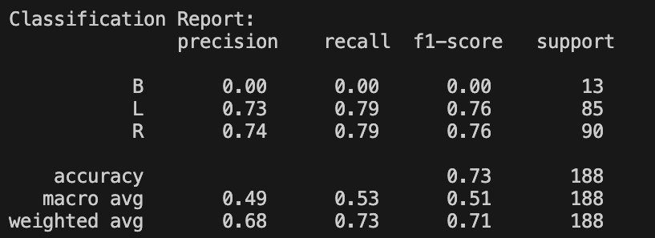

# INST737 Machine Learning Labs


Two tutorial based Python exercises exploring how training choices affect model evaluation. Built for INST737 at the University of Maryland.

## My work

I implemented the train/test split and model evaluation exercises: a housing regression example and a comparison of Gini and entropy decision trees. These are learning implementations, not production prediction services.

| Exercise | What to inspect |
| --- | --- |
| [Decision trees](decision-tree/decision-tree-tutorial-KennethYeaher.py) | Balance Scale classification, a 70/30 split, depth limited Gini and entropy trees, confusion matrices, classification reports, and tree plots. |
| [Train/test split](split-tutorial-KennethYeaher.py) | California Housing regression, an 80/20 split, training and test R², and ten actual versus predicted values. |



A cropped output capture retained in my portfolio. It documents a previous tutorial run, not a new benchmark. The class level report makes errors visible that an overall accuracy score can hide.

## Reading the results

The housing exercise prints training and test R² separately, making it possible to compare performance on fitted and held out data. The decision tree exercise reports each class separately as well as overall accuracy. In the saved output above, the balance class has zero recall: a useful reminder to inspect minority classes before interpreting a single headline score.

Both exercises use fixed split seeds in the source. They are small tutorial comparisons rather than a broad search for the best model.

## Run locally

With Python 3 available, create an environment from the repository root:

```sh
python3 -m venv .venv
source .venv/bin/activate
python -m pip install pandas numpy scikit-learn matplotlib
python decision-tree/decision-tree-tutorial-KennethYeaher.py
python split-tutorial-KennethYeaher.py
```

On Windows, activate with `.venv\Scripts\activate`. The scripts fetch datasets from UCI and scikit-learn's California Housing source, so initial runs need network access. The decision tree script opens Matplotlib windows. Dependencies are not pinned, and results can vary by library version.

---

## Author

**Kenneth Yeaher**  
MS in Human Computer Interaction  
University of Maryland, College Park  
[](https://www.linkedin.com/in/kennethyeaher/)

`Python` · `Machine Learning` · `Model Evaluation`
